# 🛍️ Eat&Drink - Gestion de Ventes Multi-Produits Événementielles

**Eat&Drink** est une plateforme e-commerce polyvalente conçue avec Laravel pour la gestion complète de stands et de produits lors d'événements. Elle offre une autonomie totale aux entrepreneurs pour vendre tout type de marchandises tout en garantissant une expérience d'achat fluide.

---

## 📸 Aperçus de la Plateforme

<p align="center">
  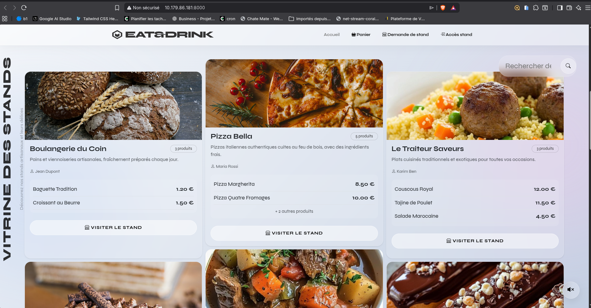
  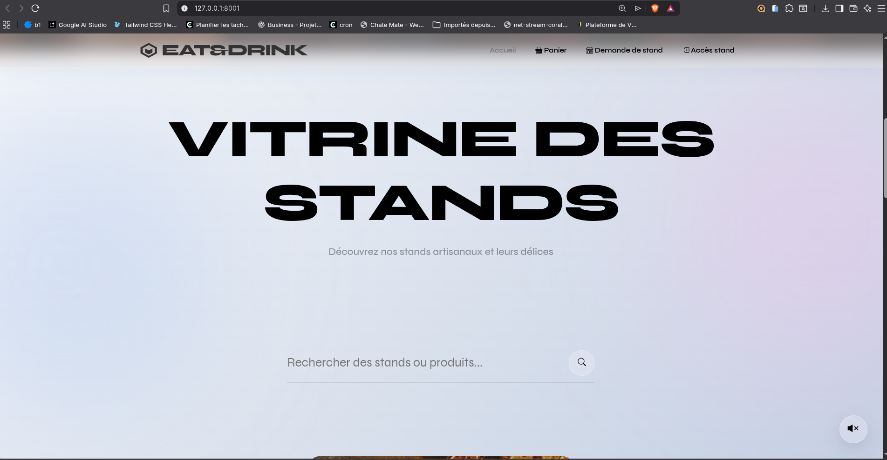
  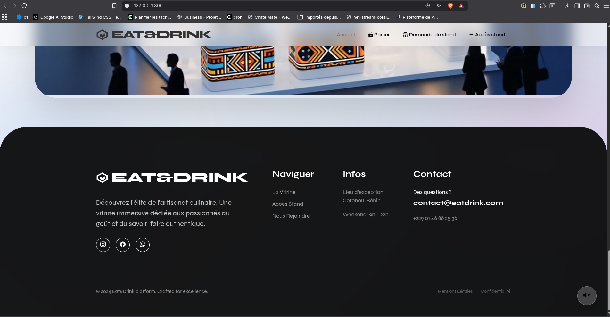
  <br />
  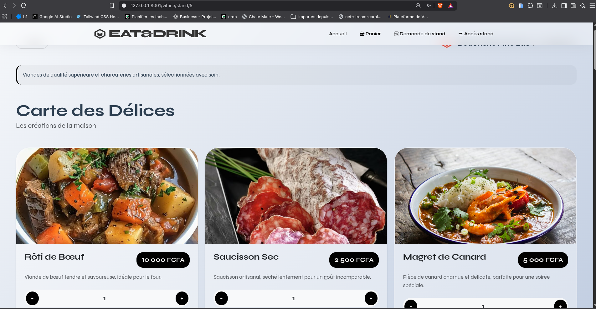
  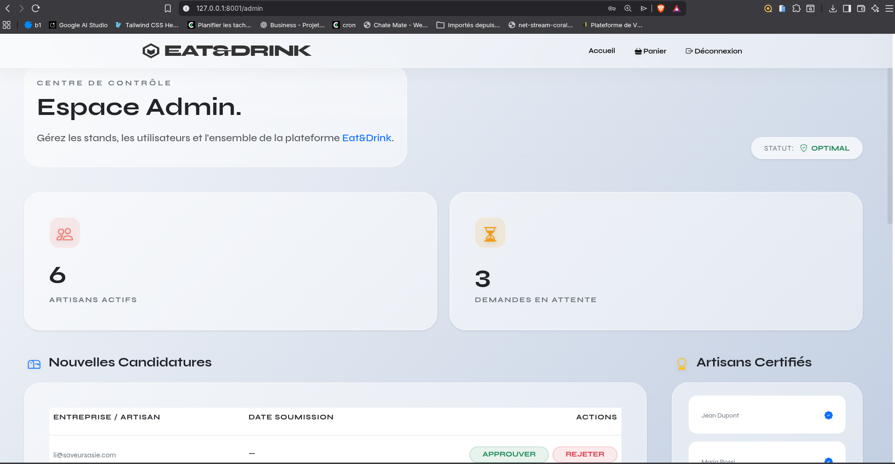
  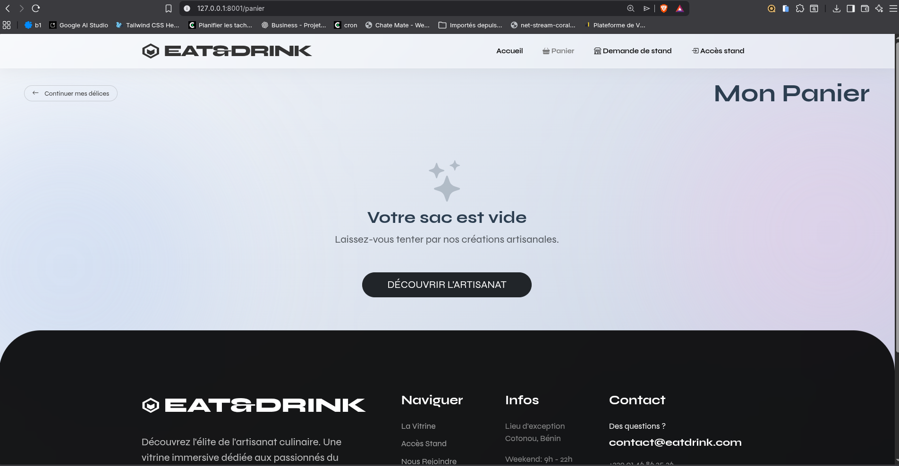
  <br />
  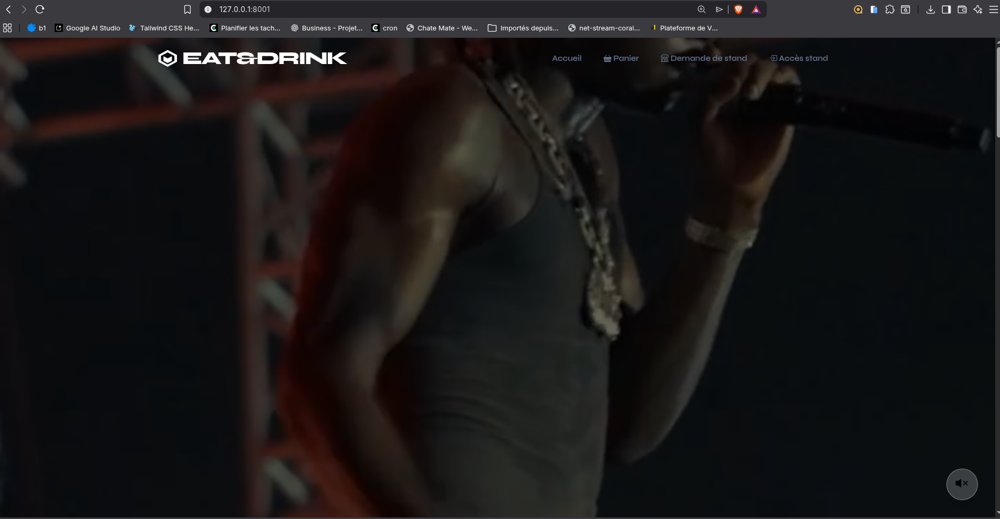
  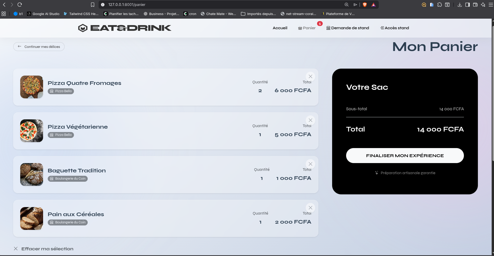
  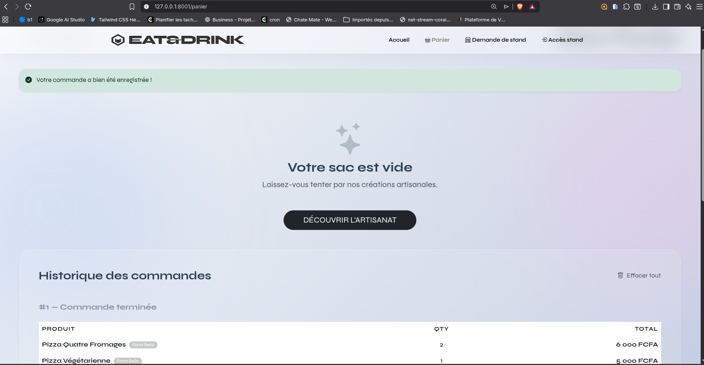
  <br />
  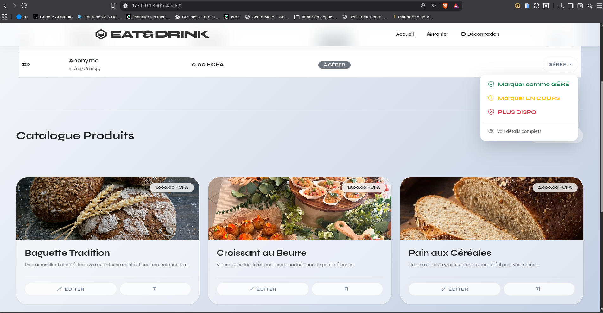
  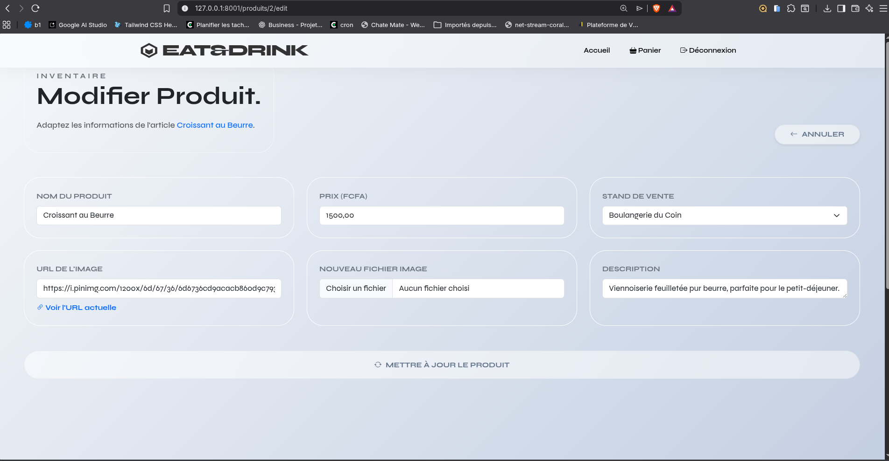
  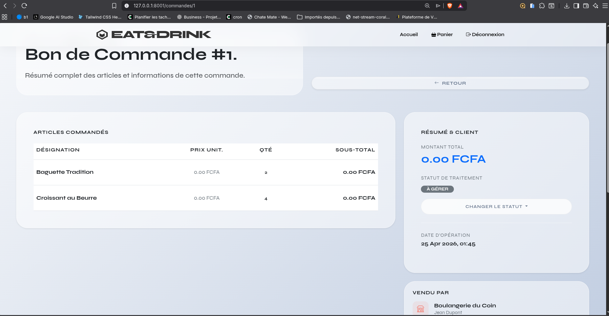
</p>

---

## 🌟 Fonctionnalités Maîtresses

### 👤 Gestion des Rôles & Accès
*   **🛡️ Administrateur** : Contrôle total, approbation des entrepreneurs et supervision globale.
*   **👨‍💼 Entrepreneur** : Gestion autonome de ses stands, produits et suivi des ventes.
*   **🛒 Client** : Panier dynamique, recherche intelligente et soumission de commandes.

### 📦 Gestion du Catalogue
*   **🏪 CRUD Stands** : Création et personnalisation d'espaces de vente thématiques.
*   **🏷️ CRUD Produits** : Gestion universelle des articles (prix, stock, images).
*   **🔍 Vitrine Intelligente** : Moteur de recherche et filtres par stand performants.

### 💳 Commandes & Logistique
*   **🛒 Panier Dynamique** : Gestion en session avec cumul automatique.
*   **📑 Groupement Automatique** : Séparation des commandes par stand lors de la validation.
*   **📈 Dashboard Stats** : Visualisation claire des revenus et de l'état des stocks.

---

## 🛠️ Stack Technique

*   **Framework** : [Laravel 11](https://laravel.com/)
*   **UI** : Bootstrap 5 (Responsive Design)
*   **Security** : Policies & Gates (Laravel Framework)
*   **Database** : MySQL / MariaDB

---

## 🚀 Installation Express

```bash
composer install
npm install && npm run build
cp .env.example .env
php artisan key:generate
php artisan migrate --seed
php artisan serve
```

---

## 📄 Licence
Ce projet est sous licence MIT. Développé par **BELLOX**.
